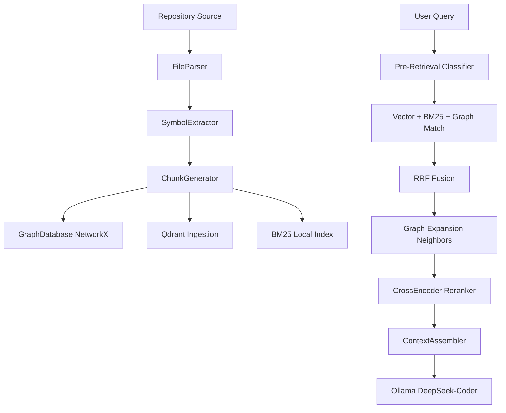

# 🔍 Repository Intelligence Platform (Code RAG V2)

A production-grade, graph-augmented repository understanding and semantic retrieval platform. Code RAG V2 parses source code repositories (Python, JS/TS, Java, C++), extracts AST symbols, builds a NetworkX relationship graph, indices snippets into Qdrant/BM25, and provides intelligent retrieval fused with Reciprocal Rank Fusion (RRF) for precise code QA.

---

## 🏗️ System Architecture



---

## 🌟 Core Features

1. **Stable Node IDs**: Every code entity is indexed with a unique, position-independent ID format: `<relative_path>::<qualified_name>` (e.g. `src/api.py::CameraManager.capture_frame`). No volatile auto-generated tokens like `class_0` or `function_1` are used.
2. **Proper Graph Database**: Replaces legacy JSON traversal with a structured **NetworkX** directed graph (`DiGraph`) modeling imports, calls, inherits, uses, defines, and contains relationships.
3. **Pre-Retrieval Query Understanding**: Classifies user queries before search to adjust candidate pools:
   * `ARCHITECTURE`: Broad search prioritizing documentation and module headers.
   * `DEPENDENCY`: Traverses graph relationships (predecessors and successors).
   * `FLOW`: Prioritizes functional snippets to trace execution paths.
   * `CONFIGURATION`: Directs lookups to YAML/JSON/env keys and config files.
   * `SYMBOL`: Looks up exact class/function matches.
   * `FILE_RECOVERY`: Grabs the entire target file chunk + all child symbols defined inside the file.
4. **Hybrid Search & RRF Fusion**: Merges semantic vector scores, keyword-matching BM25 Okapi scores, and exact graph matches via Reciprocal Rank Fusion (RRF) before second-stage reranking.
5. **Graph Neighbors Expansion**: Automatically pulls caller/callee context, imports, or sibling classes using NetworkX traversal to enrich retrieval evidence.
6. **Cross-Encoder Reranking**: Re-evaluates expanded candidate relevance against user queries using an MS-MARCO CrossEncoder model.
7. **Premium Streamlit Dashboard**: User interface featuring live database statistics, classified intent badges, visual relationship lists, code evidence expanders, and one-click global static architecture reports.

---

## 📂 Code Layout

```bash
d:\orgatisation_rag/
├── backend/
│   ├── main.py               # Main CLI trigger for indexing
│   ├── requirements.txt      # Backend Python dependencies
│   ├── llm/
│   │   └── answer_generator.py # Connection to Ollama DeepSeek-Coder model
│   └── rag/
│       ├── config.py         # Config paths, model constants, and collections
│       ├── embeddings.py     # Lazy-loaded SentenceTransformers embedding wrapper
│       ├── reranker.py       # Lazy-loaded CrossEncoder reranking wrapper
│       ├── parser.py         # Router for Tree-sitter, JSON/YAML, Markdown, and Flatfiles
│       ├── symbol_extractor.py # AST traversal code and stable Node ID generation
│       ├── chunk_generator.py  # Filters short codes and formats semantic chunks
│       ├── graph_database.py # NetworkX graph container, node linkages, and serialization
│       ├── retriever.py      # Query classification, Hybrid search, RRF, and Graph neighbors
│       ├── context_assembler.py # Deduplicated, grouped Markdown formatter for the LLM
│       ├── indexer.py        # Pipeline coordinator (scans -> parses -> indexes -> embeds)
│       └── analysis.py       # Static analyzer for repository global reports
└── frontend/
    └── app.py                # Premium Streamlit UI application code
```

---

## 🚀 Setup & Execution

### 1. Installation
Install dependencies in your python environment:
```bash
py -m pip install -r backend/requirements.txt
```

### 2. Configuration
Open `backend/rag/config.py` and set the path of the repository you want to index under `REPOSITORIES`:
```python
REPOSITORIES = [
    {
        "name": "your_project",
        "path": r"C:\path\to\your\project",
        "description": "Short description of the codebase"
    }
]
```

### 3. Ingest Repository Source Code
Ingest source files, construct the graph database, and populate vector stores:
```bash
py backend/main.py
```
This writes two storage files under `backend/data/`:
* `repository_index.json`: contains all chunks and schemas.
* `repository_graph.json`: contains the serialized NetworkX graph in node-link format.

### 4. Launch Streamlit UI Dashboard
Start the development server to query your repository:
```bash
py -m streamlit run frontend/app.py
```
Navigate to **http://localhost:8501** in your browser.

---

## 💡 Query Examples to Try

* **Full File Recovery**: *"get full code from file src/api.py"* (Classified as `FILE_RECOVERY` -> retrieves full file wrapper + all internal endpoints/methods immediately).
* **Configuration**: *"what host port parameters are defined in config.yaml?"* (Classified as `CONFIGURATION` -> prioritized YAML settings).
* **Execution Flows**: *"trace the execution flow of the validation pipeline"* (Classified as `FLOW` -> prioritizes function linkages).
* **Module Dependencies**: *"who calls or depends on the glasses_classifier module?"* (Classified as `DEPENDENCY` -> walks predecessors and successors in the imports/calls graph).
